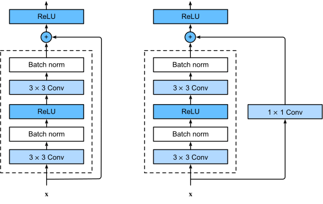

# cv-papers
This is my feeble attempt at reading and implementing various computer vision papers. Mostly for educational purposes. 

# To Dos
## Architecture (CNN) 
- [x] AlexNet
- [x] VGGNet
- [x] ResNet
- [ ] ResNetv2
- [ ] Wide ResNet
- [ ] ResNeXt
- [ ] Inception
- [ ] DenseNet
- [ ] MobileNetV1
- [ ] MobileNetV2
- [ ] MobileNetV3
- [ ] SqueezeNet
- [ ] EfficientNet
- [ ] NASNet
- [ ] XCeption
- [ ] ShuffleNet
- [ ] ConvNeXt

## Architecture (ViT)
- [x] ViT
- [ ] DETR
- [ ] Swin Transformer
- [ ] ViViT
- [ ] CaiT
- [ ] PVT
- [ ] CrossViT
- [ ] RegionViT
- [ ] ConvMixer
- [ ] Dino

## Object Detection
- [ ] YOLOv2
- [ ] YOLOv3
- [ ] YOLOv5
- [ ] YOLOv7
- [ ] YOLOv8
- [ ] SSD
- [ ] FPN
- [ ] RetinaNet
- [ ] EfficientDet
- [ ] DCN
      
## Segmentation
- [ ] SAM
- [ ] SAM 2
- [ ] SEEM
- [ ] Mask2Former
- [ ] CLIPSeg
- [ ] Vision Transformers for Dense Prediction
- [ ] SOLOv2
- [ ] U-Net
- [ ] U-Net++
- [ ] SegNet

## Pose Estimation
- [ ] Convolutional Pose Machines
- [ ] DeepCut
- [ ] Stacked Hourglass Networks
- [ ] PoseNet
- [ ] OpenPose
- [ ] AlphaPose
- [ ] Integral Human Pose Regression
- [ ] DeepPose
- [ ] DensePose
- [ ] TransPose

## Action Recognition
- [ ] ViViT: A Video Vision Transformer
- [ ] Two-Stream Convolutional Networks for Action Recognition in Videos
- [ ] C3D: Learning Spatiotemporal Features with 3D Convolutional Networks
- [ ] I3D: Quo Vadis, Action Recognition? A New Model and the Kinetics
- [ ] TSN: Temporal Segment Networks for Action Recognition in Videos
- [ ] SlowFast Networks for Video Recognition
- [ ] Non-local Neural Networks
- [ ] R(2+1)D: A Better Baseline for Video Understanding
- [ ] Attention Is All You Need for Action Recognition
- [ ] Action Recognition Using Visual Attention

## 3D VIsion
- [ ] PointNet
- [ ] PointNet++


## Table of Contents
- [Resnet](#resnet)
- [ViT](#vit)
- [EfficientNet](#efficientnet)
- [UNet](#unet)
- [YOLOv1](#yolov1)

## Resnet


The ResNet <a href="https://arxiv.org/abs/1512.03385"> paper </a> introduces the concept of residual learning, where instead of directly learning the desired mapping, the network learns the residual (difference) between the input and the output. This is formalized as $F(x) = H(x) - x$, $H(x)$ is the desired function and $x$ is the input.

A residual block consists of a series of convolutional layers with a skip connection (or shortcut) that bypasses these layers and adds the input directly to the output. This helps in addressing the vanishing gradient problem and allows for the training of much deeper networks.

You can use it by importing the `resnet` model as shown below:

```python
import torch
from cv_imp import resnet

model = resnet.ResNet152(input_channels=3, num_classes=10)
img = torch.randn(1, 3, 256, 256)
preds = model(img)
print(preds)
print(preds.shape) # torch.Size([1, 10])
```

## ViT 


Vision Transformer is an encoder only transformer model adapted for computer vision task. 

Before reading the paper, I went through a few youtube videos and found these to be of a lot of help: 
 1. <a href="https://www.youtube.com/watch?v=TrdevFK_am4"> An Image is Worth 16x16 Words: Transformers for Image Recognition at Scale (Paper Explained) by Yannic Kilcher 
 </a>

2. <a href="https://www.youtube.com/watch?v=vsqKGZT8Qn8"> Visual Transformer Basics by Samuel Albanie </a>

You can use it by importing the `ViT` model as shown below:

```python
import torch
from cv_imp.vit import ViT
model = ViT(image_size=(512,512),
            patch_size=(32,32),
            num_classes=1000,
            dim = 1024,
            num_transformer_layers = 7,
            num_heads = 16,
            mlp_hidden_dim = 2048,
            pool="cls",
            num_channels=3,
            dropout_proba=0.5,
            emb_dropout_proba=0.5
            )
img = torch.randn(1, 3, 256, 256)

preds = model(img)
print(preds)
print(preds.shape) # torch.Size([1, 1000])


```

## EfficientNet
The EfficientNet paper introduces a compound scaling method that uniformly scales all dimensions of depth, width, and resolution using a set of fixed scaling coefficients. The compound scaling is achieved through three coefficients: 

Depth $(α)$: This parameter scales the number of layers in the network.
Width $(β)$: This parameter scales the number of channels in each layer.
Resolution $(γ)$: This parameter scales the input image size.

These three cofficients were obtained in the paper through a process of grid search and optimization on a baseline model EfficientNet-B0. 

$α$ = 1.2
$β$ = 1.1 
$γ$ = 1.15 

The scaling of these dimensions is determined by the following relationships:


At the core of EfficientNet is the MBConv block, which utilizes depthwise separable convolutions to reduce computational cost while maintaining performance. These blocks also incorporate squeeze-and-excitation (SE) modules to enhance the network's ability to capture important features by adaptively recalibrating channel-wise feature responses. Additionally, skip connections (similar to those in ResNet) are used to help with feature reuse, making the network both deep and lightweight.


You can use it by importing the efficientnet model as shown below:

```python
import torch
from cv_imp.efficientnet import EfficientNet_B2

img = torch.randn(1, 3, 224, 224)
model = EfficientNet_B2(num_classes=1000)
preds = model(img)
print(preds.shape) # torch.Size([1, 1000])
```

## UNet
```python

import torch
from cv_imp.unet import UNet

img = torch.rand((1, 1, 160,160))
model = UNet(1,1)
preds = model(img)
print(img.shape)
print(preds.shape)
assert img.shape == preds.shape

```

## YOLO v1

https://www.youtube.com/watch?v=ag3DLKsl2vk&t=296s

```python
import torch
from cv_imp.yolo_v1 import Yolo_v1

img = torch.rand((2, 3, 224, 224))
model = Yolo_v1(split_size=7, num_boxes=2, num_classes=20)
preds = model(img)
print(preds.shape) 
```c
